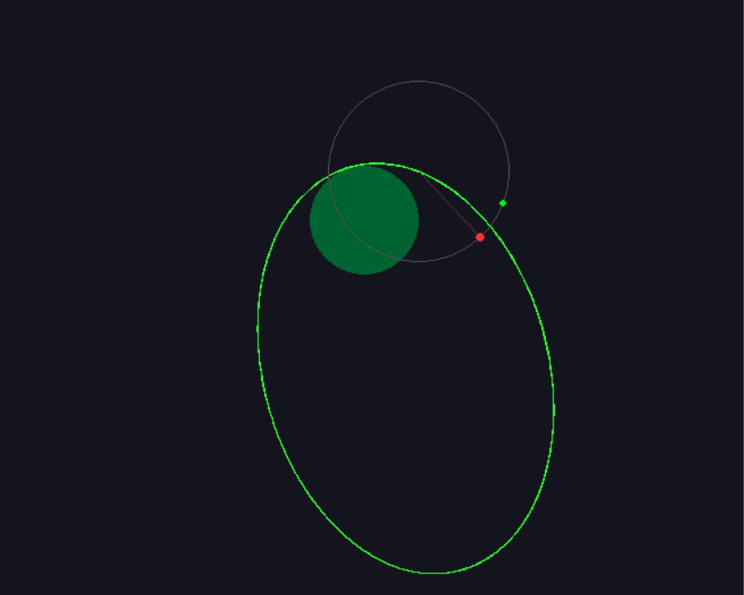

# Saturn V Autonomous Flight Simulator

---

# Project Overview

A physics-based flight simulator written in Python from scratch. It models N-Body gravity (Earth/Moon) and multistage rocket mechanics in 2D, featuring a custom flight computer capable of autonomous missions.

## Key Features
* **Physics Engine:** Custom implementation of Newton's Law of Universal Gravitation, atmospheric drag, and 3-stage rocket separation dynamics.
* **Guidance Computer:** A Finite State Machine (FSM) autopilot capable of:
  * **GSO Insertion:** Autonomous launch, gravity turn, and circularization at 35,786 km.
  * **Lunar Mission:** Autonomous parking orbit, phasing wait, and Trans-Lunar Injection (TLI) targeting.
* **Trajectory Prediction:** Real-time Runge-Kutta integration to visualize orbital paths and impact points.
* **Rendering:** Custom Pygame vector rendering with dynamic time-warp scales (up to 1000x real-time).

## How to Run
1. Install Pygame: `pip install pygame`
2. Run the simulation: `python Main.py`
3. Follow the on-screen menu to select Manual, GSO, or Lunar modes.

## The Math
* **Orbital Insertion:** Solves the Vis-Viva equation to predict apogee/perigee in real-time.
* **Lunar Capture:** Uses a Sphere of Influence (SOI) trigger (66,000 km) to switch coordinate systems from Earth-Centric to Moon-Centric for retrograde capture burns.
